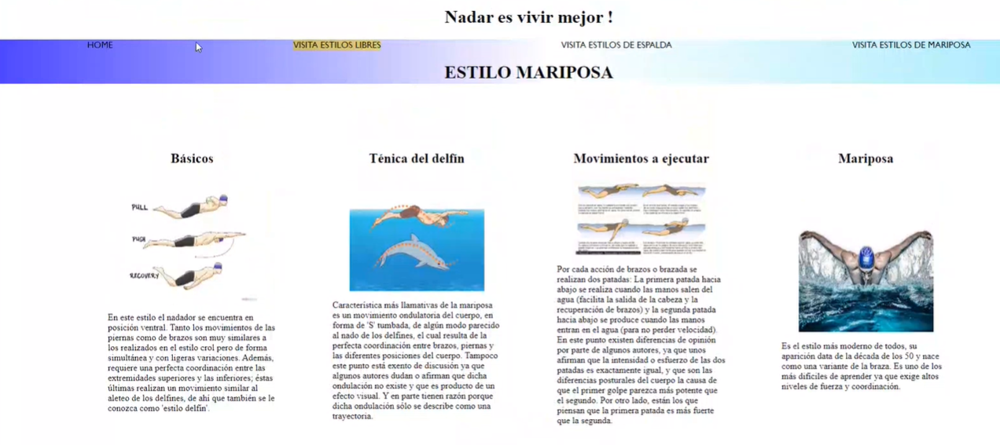

# Node-Angular-ApiSwim

Remember if you clone it:

`npm i`

## Application preview style

--- 

# Start server: 
`npm run dev || npm start`

# Deployed web: 
`ng serve -o`

--- 

## Used 

`Backend`

NodeJs & Mongoose & Express

`BBDD`=> MongoDB

`Frontend`

Angular & Sass

